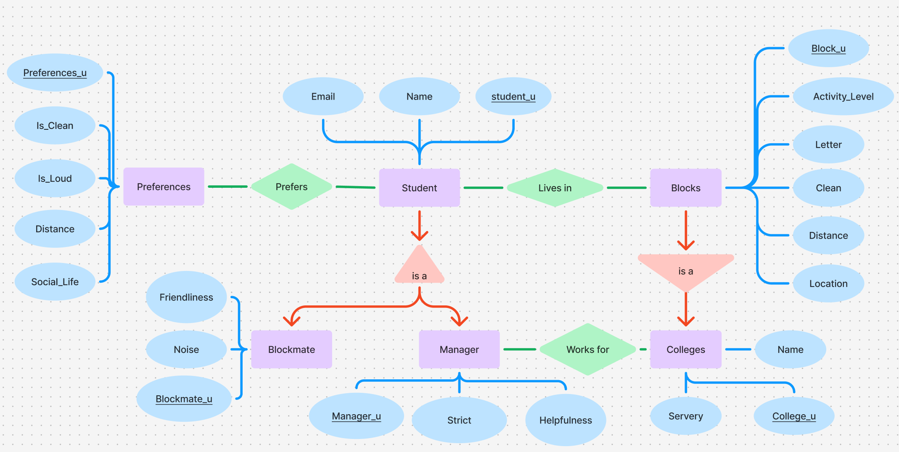

# DB-project

## Contributor
- Mateo Pico
- Harishi Velavan
- Nikolay Tsonev

This repo is for the documentation of our project and uploading the files for submission for Databases and Web services cours

## Week 2

This week we have updated our ER model to more accurately and consisely show the model we plan to use for our databse. Additionally we have added the schema at test.sql that initializes our databse with all the entities and relationships displayed in our ER model. 

