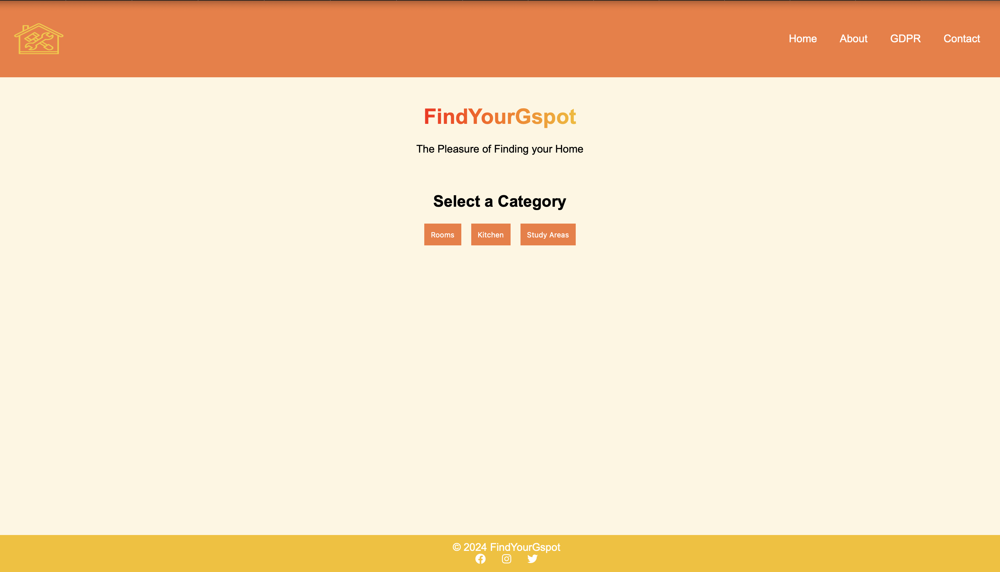

# DB-project

## Contributors
- Mateo Pico (front end developer)
- Harishi Velavan (database developer)
- Nikolay Tsonev (back end developer)

This repo is for the documentation of our project and uploading the files for submission for Databases and Web services course

## Week 2

This week we have updated our ER model to more accurately and consisely show the model we plan to use for our databse. Additionally we have added the schema at test.sql that initializes our databse with all the entities and relationships displayed in our ER model. 

figure 1: ER Model

## Week 5

We have:
- created our CD along side images and logos for our frontend (All of this can be found under assignment_5) 
- Created the basic fronted in HTML (which can be found in the root directory of this repo index.html)
- hosted our fronted using github pages
 

Because of github pages, the index file must always be in the root of the directory or in the docs folder. Apart from the index file, every other frontend and backend file will be found in seperate folders. The website can be reached by visiting [findyourgspot.eu](http://findyourgspot.eu)

 

figure 2: Homepage

for now the website looks like this but will be changed and improved on in future weeks by adding more features and interactions for the usrer. 

hello world, this was added by harishi