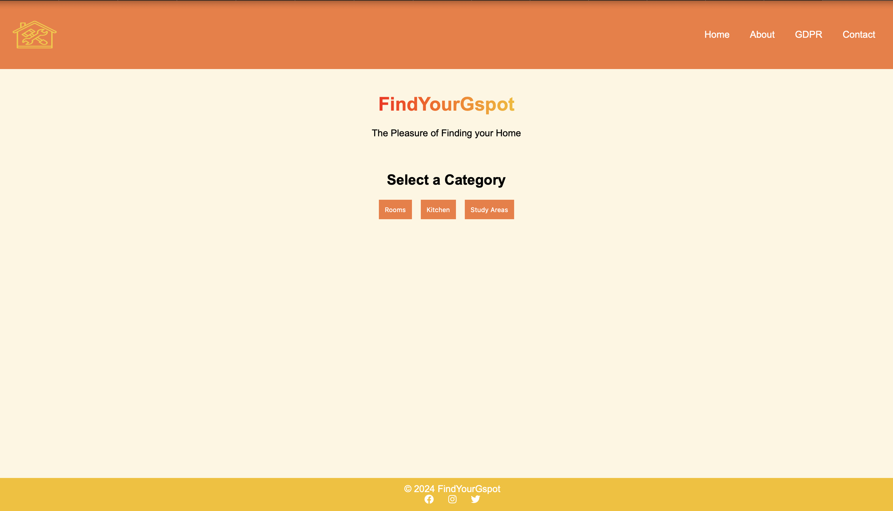

# DB-project

## Contributors
- Mateo Pico (front end developer)
- Harishi Velavan (database developer)
- Nikolay Tsonev (back end developer)

This repo is for the documentation of our project and uploading the files for submission for Databases and Web services course

## Week 2

This week we have updated our ER model to more accurately and consisely show the model we plan to use for our databse. Additionally we have added the schema at test.sql that initializes our databse with all the entities and relationships displayed in our ER model. 

figure 1: ER Model

## Week 4

We have:
- created our CD along side images and logos for our frontend (All of this can be found under assignment_5) 
- Created the basic fronted in HTML (which can be found in the root directory of this repo index.html)
- hosted our fronted using github pages
 

Because of github pages, the index file must always be in the root of the directory or in the docs folder. Apart from the index file, every other frontend and backend file will be found in seperate folders. The website can be reached by visiting [findyourgspot.eu](http://findyourgspot.eu)

 

figure 2: Homepage

for now the website looks like this but will be changed and improved on in future weeks by adding more features and interactions for the usrer. 

## Week 5

This week, the frontend form was implemented. Before the user even sees the form, they have an introductory text. For now it is very bare bones but will be improved in the future. After that a form is presented. All the error handling is done on the front end. If none of the inputs were modified, the user will be notified. Otherwise the data is converted to a JSON with it being:  
  

    <code>{ categorie: howImportantItIs }</code> 

 
  
and sent to the php server using AJAX.

For now the server only responds with a success or failure and then notifies the user, but in the future the response will be the block that best suits the user and its attributes. 

    <video width="320" height="240" controls>
    <source src="./assignment_5/demo-of-ajax.webm" type="video/mp4">
    Your browser does not support the video tag.
    </video>

figure 3: Homepage Demo Video

## Week 6

updated the backend where now it creates a connection to the DB, queuries it for the college name and block letter that match
with the same qualities that the user wants. if nothing is found then it will give a coresponding error message, but that will
be delt with at the front end, as the js will check if json object is empty and tell the user that there is no room.

for future we will have some algorithm that is more lenient because, realistically speaking it is not possible to find a block
with `exactly` what you want. 

on the front-end we have made it that when the form is submitted and the sql data is sent back from the server, the 
js will share the file to another file using `localStorage` and then redirecting to the output.html page. if the result is nothing an according message is given that the user just does not fit any room on campus, otherwise a table of the block and
colleges that match the user's taste shows up. 

Because of technical dificulties with apache and the mysql not giving us access to set it up, the DB is not working so we cant
proceed as the js does not allow to proceed if invalid data is sent back. 

PS. please use firefox for best user experience!

## Week 7

This week, we focused on strengthening our web service security and implemented essential user authentication features.

1. **Email Security**: We set up encrypted email communication using a plugin (e.g., Enigmail) to ensure secure interaction with the TAs. We generated a key pair and digital signature, sending the public key to the TA, followed by an encrypted, signed email to verify secure message delivery.

2. **Access Control for Maintenance Pages**: To protect our service against unauthorized access, we implemented a basic user management system:
   - Created an `auth.php` file for backend authentication processes, ensuring restricted access to maintenance functionalities.
   - Configured a user table to store admin credentials for secure access.
   - Developed user authentication interfaces and logic to validate login details on the server, blocking unauthorized access with an appropriate error message.

3. **User Login and Registration**: We expanded the security framework by implementing user login and registration pages:
   - **Login and Registration Pages**: Files such as `Login_page.html`, `Login_page.css`, `Login_page.js`, `Register_page.html`, `Register_page.css`, and `Register_page.js` were added to support user authentication.
   - **Backend Authentication**: The `auth.php` file interacts with `gspot_lib.php` to verify user credentials securely.
   - **Session Management**: The login and registration components are set up to support session management, further securing user interactions.

With these additions, we laid a solid foundation for user authentication and enhanced security across the service. The code and configuration files for these updates are available in the repository for review and testing.

Here's an updated summary for Week 8 that fits the tone and detail level of your README:

## Week 8

This week, we set up a new `apache_server` directory to house our database server, which is currently operational on our local system. We encountered some connectivity challenges with the university's server, which we are actively addressing to enable broader access.

Additionally, we created an `analysis.pdf` file that documents the IP addresses of all PHP files within our project. This file includes detailed access statistics, such as each page’s access frequency, originating IP addresses, and browser information. We have also added two logging scripts, `access_log.php` and `error_log.php`, to track and log requests and errors. These logs allow us to generate insightful usage timelines and error diagnostics, facilitating continuous improvement and debugging of the service.

